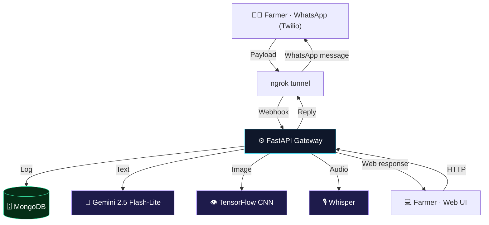

[README.md](https://github.com/user-attachments/files/32947835/README.md)
<div align="center">


[](https://github.com/MrWhiiteHat)
[](https://github.com/MrWhiiteHat?tab=repositories)
[](https://neuroflux-alpha.vercel.app)


</div>


## 👨‍💻 About Me

<div align="center">

</div>

- 🎓 B.Tech student in **Computer Science & Engineering**
- 🛡️ **Cybersecurity & application security**
- 🤖 **Artificial intelligence & machine learning**
- 🔬 **Security research & automation**
- 🚀 Building **practical real-world software**


## 🛠️ Tech Stack



<div align="center">


</div>


## 🚀 Featured Projects

<div align="center">

<a href="https://github.com/MrWhiiteHat/LLM-Powered-Autonomous-Mobile-Application-Security-Penetration-Testing-Platform"></a>
<a href="https://github.com/MrWhiiteHat/AI-Powered-Agricultural-Advisory-Chatbot-for-Indian-Farmers"></a>
<a href="https://github.com/MrWhiiteHat/KSecurity-Ai-Intelligence-Discord-bot"></a>
<a href="https://github.com/MrWhiiteHat/discord_bot"></a>

</div>

<br/>

<details open>
<summary><h3>🛡️ LLM-Powered Autonomous Mobile App Security Penetration Testing Platform</h3></summary>

> An autonomous platform that automates mobile app penetration testing through a **10-step security pipeline**, powered by a **FastAPI** backend and a local **ChromaDB** vector database for RAG.



| Layer | Details |
|---|---|
| **Frontend** | Vanilla JavaScript, HTML5 & CSS3 dashboard using async Fetch APIs |
| **API Engine** | FastAPI running OS-level routines and async pentest workers |
| **RAG Knowledge Base** | Local ChromaDB storing OWASP Mobile Top 10 & API Top 10 mappings |
| **Deployment** | `deploy.py` uses Paramiko to ship and daemonize (`systemd`) the app on an Ubuntu VPS over SSH, with `ufw` rules |

| # | Step | What happens |
|---|---|---|
| 1 | Reconnaissance | OSINT and metadata gathering |
| 2 | Static Code Analysis | Code logic, permissions, hardcoded secrets |
| 3 | Reverse Engineering | Config binaries, hidden URLs, internal assets |
| 4 | Storage Security | Local file caching and DB flaws |
| 5 | Network Security | TLS validation, cryptographic handshake flaws |
| 6 | API Security | REST/GraphQL endpoints found in the binary |
| 7 | Dynamic Runtime | Memory validation, instrumentation checks |
| 8 | Vulnerability Mapping | Findings mapped to OWASP |
| 9 | Risk Assessment | Scores contextualized with CVSS |
| 10 | Report Generation | Automatic `JSON` and `HTML` reports |

```bash
git clone git@github.com:MrWhiiteHat/LLM-Powered-Autonomous-Mobile-Application-Security-Penetration-Testing-Platform.git
cd LLM-Powered-Autonomous-Mobile-Application-Security-Penetration-Testing-Platform
python -m venv venv && source venv/bin/activate
pip install -r backend/requirements.txt
cd backend && python main.py   # dashboard at http://localhost:8000
```

> ⚠️ For **educational and authorized penetration testing only.**

</details>

<details open>
<summary><h3>🌾 KrishiMitra (कृषि मित्र) — AI Agricultural Advisory Chatbot for Indian Farmers</h3></summary>

> A production-ready, resilient AI chatbot giving real-time, localized farming advice in vernacular languages via **WhatsApp** and a **Web UI**.

- 🌿 **Crop disease detection** — leaf photo → MobileNetV2 CNN diagnosis → Gemini treatment plan
- 🎙️ **Voice & multilingual** — Hindi/English voice notes via OpenAI Whisper
- ☀️ **Hyper-local weather advisory** — OpenWeatherMap matched to registered crops
- 💰 **Live mandi prices** — know when and where to sell
- 📋 **Government schemes (RAG)** — subsidy suggestions like PMFBY
- 🛡️ **Graceful degradation** — falls back to simulations if heavy models can't load



| Component | Technology | Purpose |
|---|---|---|
| Backend API | `FastAPI` | Async webhook routing |
| LLM Engine | `Google Gemini 2.5 Flash-Lite` | Intent, reasoning, translation |
| Computer Vision | `TensorFlow` (MobileNetV2) | CNN trained on 54k+ PlantVillage images |
| Speech-to-Text | `OpenAI Whisper` | Multilingual transcription |
| Database | `MongoDB` (Motor) | Farmer profiles and chat history |
| Messaging | `Twilio Sandbox API` | Bridges the server to WhatsApp |
| Frontend | `HTML/CSS/JS` | Glassmorphism-themed web chat |

Run: `pip install -r requirements.txt` → add `.env` keys → `python run.py` → `http://localhost:8000/chat`. For WhatsApp: `npx ngrok http 8000` and set the Twilio sandbox webhook to `/api/webhook`.

</details>

<details open>
<summary><h3>🕵️ KSecurity — Community Threat Intelligence Platform</h3></summary>

> AI-powered security platform that detects **scams, phishing, malicious links and suspicious behavior** in Discord communities.

| Service | Stack | Port |
|---|---|---|
| **Backend API** | Node.js + Express + TypeScript + Prisma (SQLite dev / PostgreSQL prod) | `3001` |
| **Admin Dashboard** | Next.js + Tailwind CSS | `3000` |
| **Discord Bot** | discord.js + TypeScript | background |
| **AI** | OpenAI API | — |

Ships with Docker, `docker-compose`, Railway config and GitHub Actions workflows.

</details>

<details open>
<summary><h3>🌐 NeuroFlux &amp; 🤖 discord_bot</h3></summary>

- **[NeuroFlux](https://neuroflux-alpha.vercel.app)** — live demo on Vercel
- **[discord_bot](https://github.com/MrWhiiteHat/discord_bot)** — Python Discord bot

</details>


## 📊 GitHub Analytics

<div align="center">


</div>


